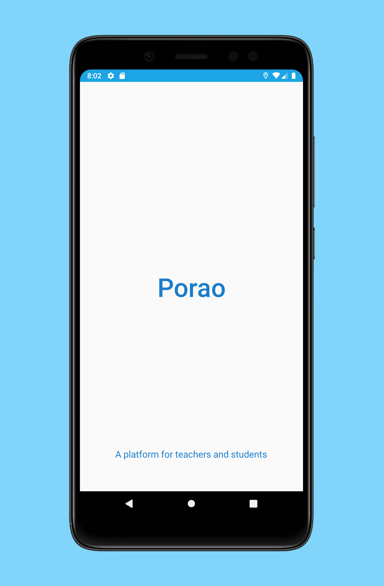
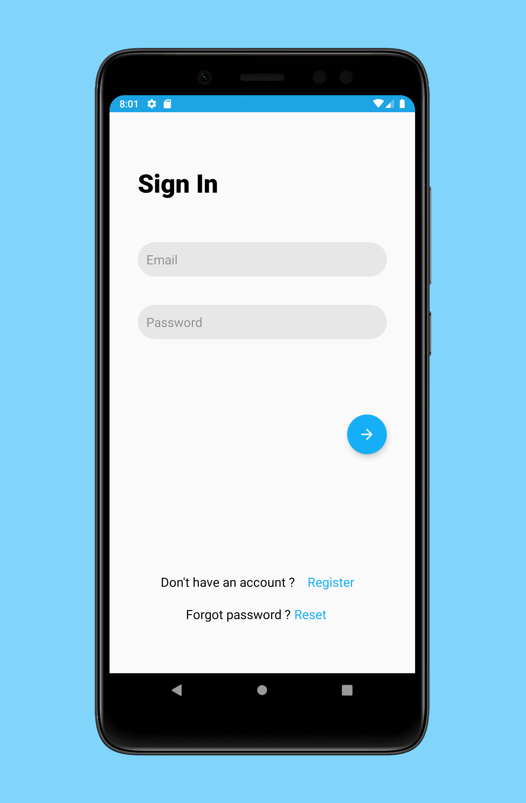
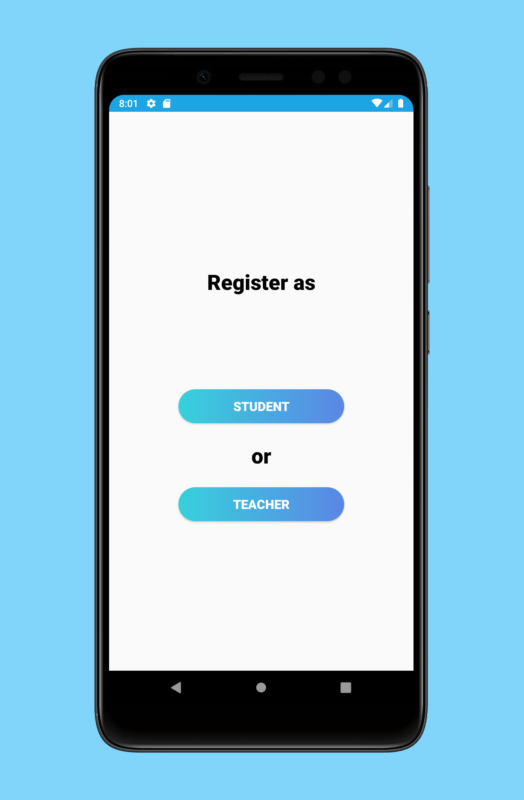
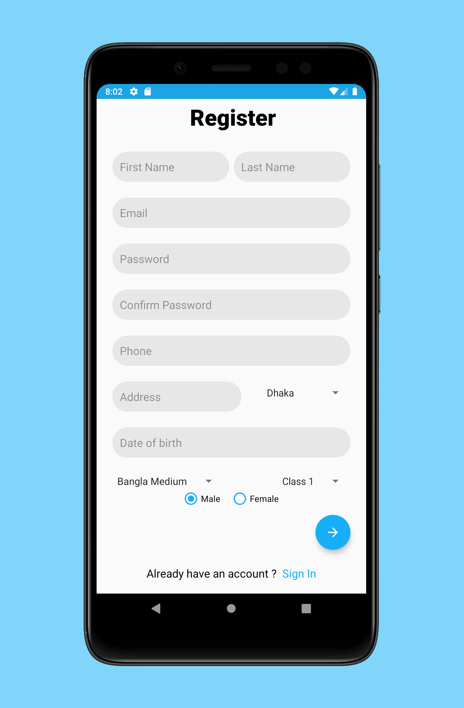
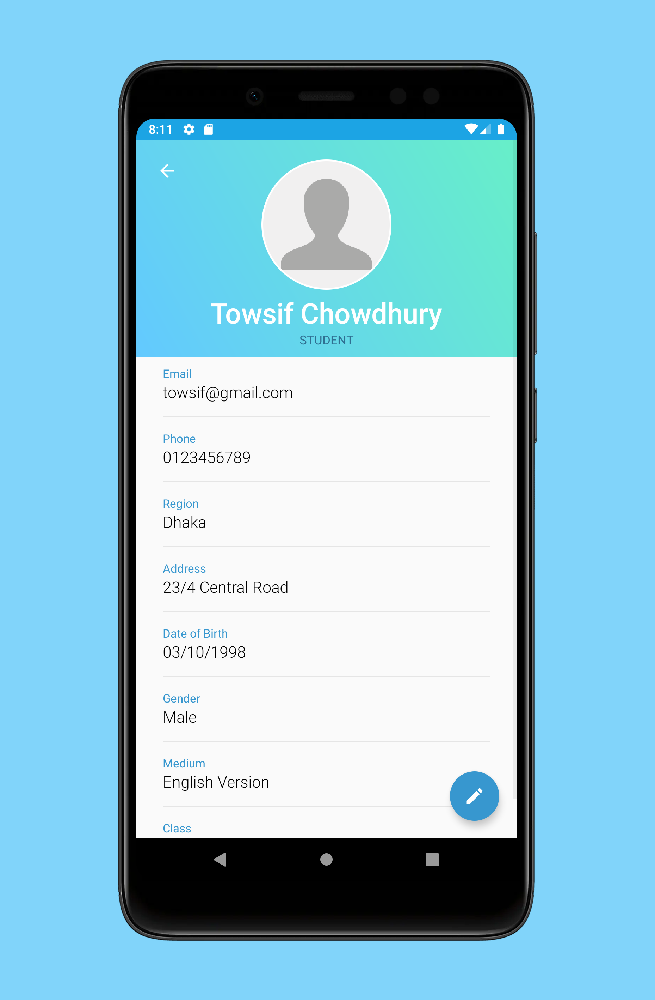
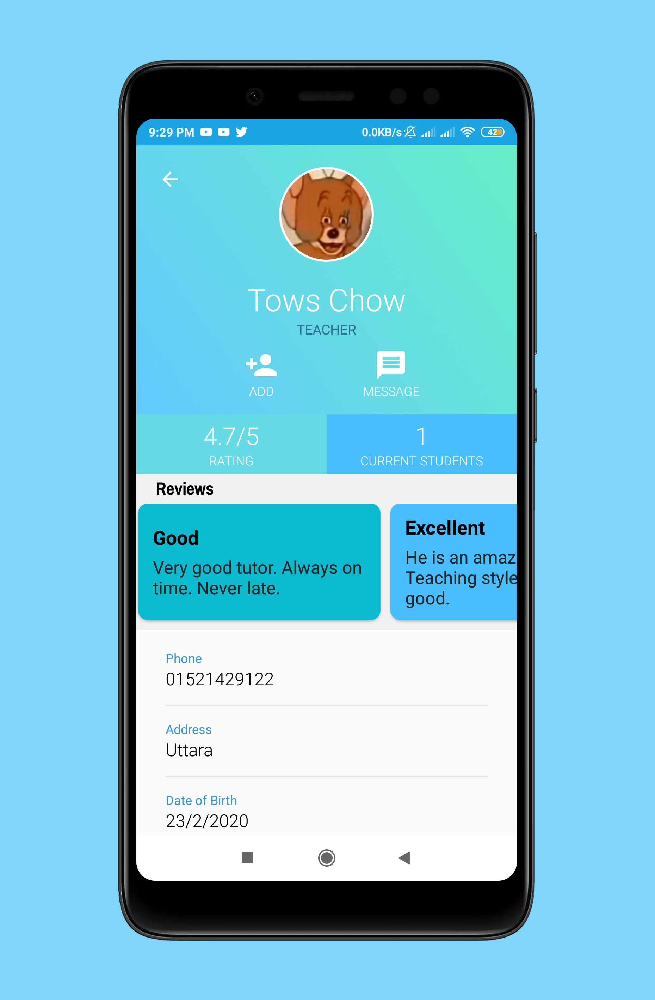
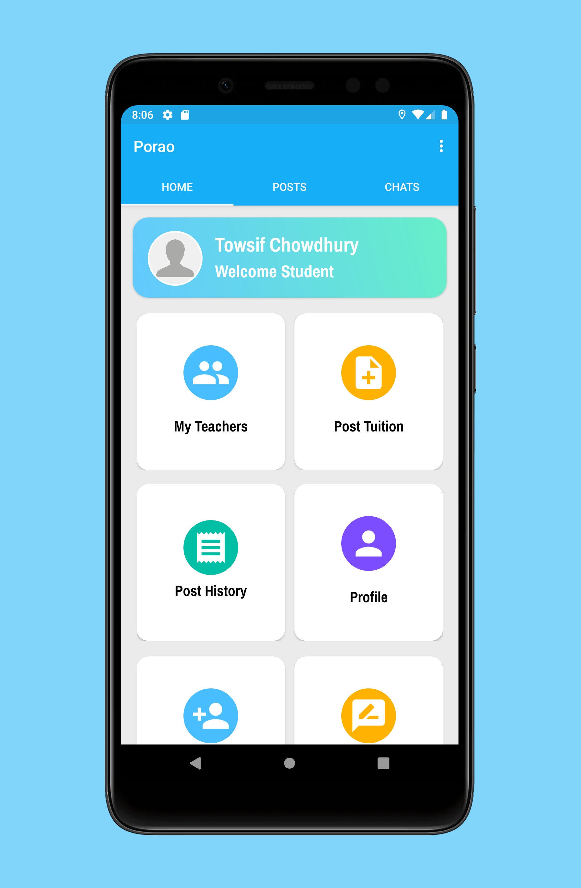
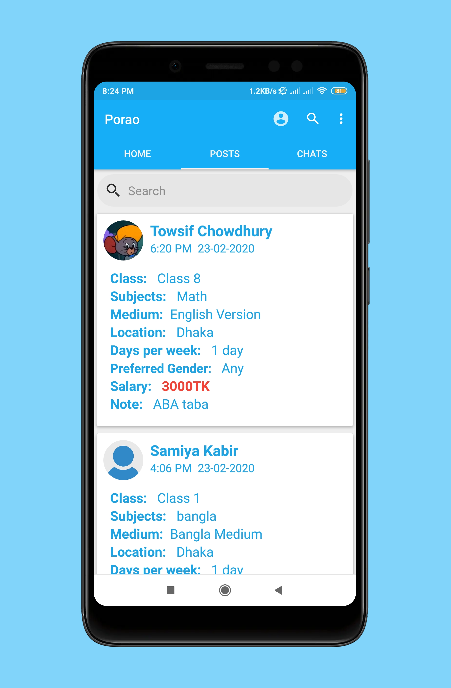
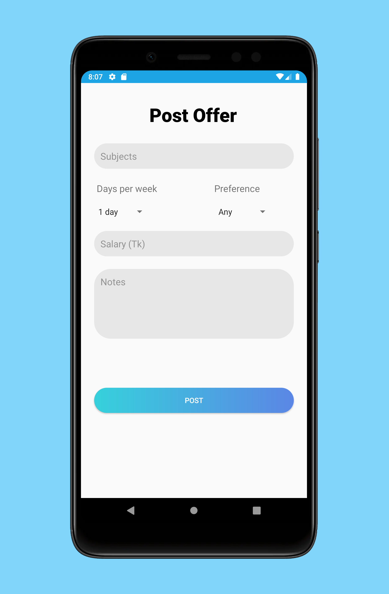
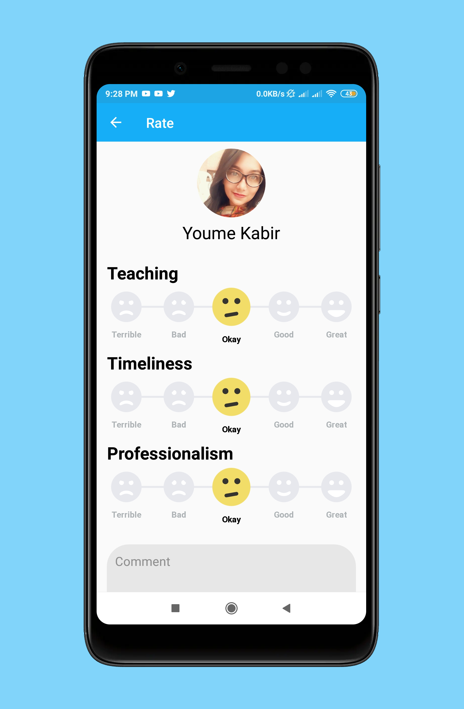

# TuitionApp

'Porao' is an app based platform to connect tutors and students. Through this app both students and teachers can post tuition offers and they can communicate with each other. The students and tutors can chat and can connect through video call with this app. The students and also give reviews about their tutor thoruht this app and can rate them.

**Contribution :**
1. [Samiya Kabir Youme](https://github.com/Youme01)
2. [Hossain Ahamed](https://github.com/ALVI0017)
